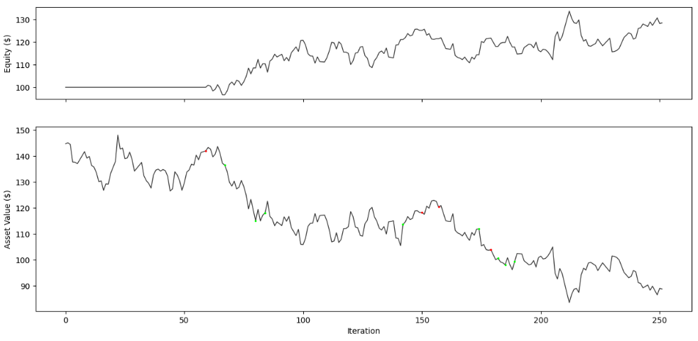

# fragments - Procedural Trading Stratery Optimization Library

This library allows you to procedurally find trading strategies for financial markets. Work in progress.

## Example
```python
# Load GOOG stock data
with open("../data/GOOG.pkl", "rb") as f:
    ohlcv_list = pkl.load(f)

param_storage = ParamStorage() # Initiate storage for the optimizer
strategies = list()
strategies.append(CrossoverStrategy(SMA(param_storage), SMA(param_storage), param_storage))
# Find the optimal strategy
results = optimize(strategies[-1], equity, ohlcv_list, random_state=42, initial_point_generator="sobol")
# Make an intuitive plot of the results
plot(strategies[-1], ohlcv_list)
```

